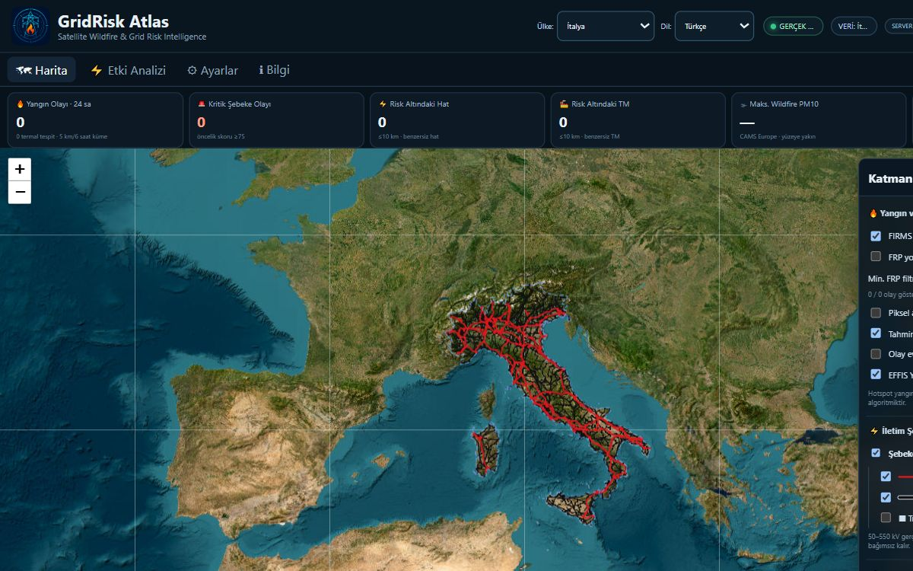

# GridRisk Atlas

**Satellite Wildfire & Grid Risk Intelligence**

[](https://github.com/murathany90/gridrisk-atlas/actions/workflows/ci.yml)
[](https://github.com/murathany90/gridrisk-atlas/actions/workflows/pages.yml)

> Sürüm / Version: **v3.8.0** · [Canlı demo / Live demo](https://gridriskatlas.com/) · Arayüz / Interface: **Türkçe + English**

> Not: Eski GitHub Pages adresi `https://murathany90.github.io/gridrisk-atlas/` yeni canonical domaine yönlendirilir.

GridRisk Atlas; uydu yangın gözlemlerini, atmosfer modellerini ve gerçek OpenStreetMap iletim şebekesi verisini tek bir karar destek haritasında birleştirir. Türkiye, İspanya, Fransa, Portekiz, İtalya ve Yunanistan desteklenir.

GridRisk Atlas combines satellite fire observations, atmospheric models and real OpenStreetMap transmission-grid data in one decision-support map. It supports Türkiye, Spain, France, Portugal, Italy and Greece.



## Hızlı bağlantılar / Quick links

- [Canlı demo — Türkçe](https://gridriskatlas.com/?country=TR&lang=tr)
- [Live demo — English](https://gridriskatlas.com/?country=TR&lang=en)
- [Kurulum / Installation](#kurulum--installation)
- [Kullanım / Usage](#kullanım--usage)
- [Kaynak kod / Source](https://github.com/murathany90/gridrisk-atlas)
- [Issues](https://github.com/murathany90/gridrisk-atlas/issues)
- [Releases](https://github.com/murathany90/gridrisk-atlas/releases)

## Özellikler / Features

- Sayfa yenilenmeden çalışan bağımsız ülke ve dil seçicileri; `?country=TR|ES|FR|PT|IT|GR&lang=tr|en` URL durumu.
- FIRMS tespitlerini 5 km/6 saat penceresinde olaylara kümeleme ve varsayılan 30 MW FRP filtresi.
- Çoklu kaynak termal tespit altyapısı: kayıt (registry), EUMETView WFS istemcisi, Sentinel-3A/B SLSTR adapterları ve özellik bayrağı ardında isteğe bağlı MTG FCI FRP kaynağı; kaynaklar arası eşleştirme (association) aynı olayı gösterir ama FRP'leri asla toplamaz.
- Yangın–hat/TM yakınlığı, FRP, tespit yaşı, varlık sınıfı ve rüzgâr doğrultusunu kullanan operasyonel öncelik skoru.
- CAMS yangın kaynaklı PM10 yayılımı, Open-Meteo rüzgârı, EFFIS doğrulama katmanları ve MTG uydu zaman çizelgesi.
- CSV, JSON ve GeoJSON dışa aktarımı; makine alanları dil değişiminden bağımsız kalır.
- Responsive masaüstü/mobil arayüz, mobil mini-card ve isteğe bağlı detay paneli.

## Ülke kapsamı / Country coverage

| Kod  | Türkçe   | English  | Kapsam / Coverage                                                                                          | Saat dilimi / Timezone |
| ---- | -------- | -------- | ---------------------------------------------------------------------------------------------------------- | ---------------------- |
| `TR` | Türkiye  | Türkiye  | Türkiye                                                                                                    | `Europe/Istanbul`      |
| `ES` | İspanya  | Spain    | Ana kara ve Balear Adaları; Kanarya Adaları hariç / Mainland and Balearic Islands; Canary Islands excluded | `Europe/Madrid`        |
| `FR` | Fransa   | France   | Metropolitan Fransa ve Korsika / Metropolitan France and Corsica                                           | `Europe/Paris`         |
| `PT` | Portekiz | Portugal | Ana kara; Azorlar ve Madeira hariç / Mainland; Azores and Madeira excluded                                 | `Europe/Lisbon`        |
| `IT` | İtalya   | Italy    | Ana kara, Sicilya ve Sardinya / Mainland, Sicily and Sardinia                                              | `Europe/Rome`          |
| `GR` | Yunanistan| Greece   | Yunanistan ana karası, Girit ve büyük adalar / Mainland Greece, Crete and major islands                    | `Europe/Athens`        |

Dil sayı ve tarih biçimini (`tr-TR` veya `en-GB`), ülke ise saat dilimini belirler. Bu iki seçim birbirinden bağımsızdır.

## Veri kaynakları / Data sources

- **NASA FIRMS:** NOAA-21, NOAA-20 ve Suomi-NPP VIIRS NRT termal tespitleri; isteğe bağlı MODIS NRT. FIRMS noktası yangın perimetresi değildir.
- **EUMETView WFS (Sentinel-3 SLSTR):** `copernicus:sentinel3a_slstr_level2_frp` ve `copernicus:sentinel3b_slstr_level2_frp` katmanları üzerinden 24 saatlik FRP tespitleri; uydu geçiş sıklığı nedeniyle tespit boşlukları normaldir.
- **EUMETView WFS (MTG FCI FRP):** `mtg_fd:frp` katmanı; raster WMS ürünü sayısal FRP olarak işlenmez, yalnızca gerçek WFS özellikleri kullanılır.
- **Copernicus EFFIS:** Fire Weather Index ve NRT yanmış alan/doğrulama WMS katmanları. Haritadaki algoritmik poligon resmî saha perimetresi değildir.
- **CAMS Europe / Open-Meteo:** Yangın kaynaklı PM10 model tahmini. Model çıktısı ölçüm istasyonu gözlemi değildir.
- **EUMETSAT MTG-I:** GeoColour WMS uydu kareleri; seçilen ve backfill ile gerçekten gösterilen UTC zamanı ayrı izlenir.
- **OpenStreetMap:** 50–550 kV iletim hatları ve trafo merkezleri, © OpenStreetMap contributors, ODbL 1.0.
- **Open-Meteo Weather:** 10 m, 850 hPa ve 700 hPa rüzgâr hız/yön model verisi.

## Şebeke sınıflandırması / Grid classification

Gerçek kaynak gerilimi `actualVoltageKv` alanında korunur. Altı ülke aynı iki analiz sınıfını kullanır:

| Gerçek OSM gerilimi / Actual OSM voltage | Runtime sınıfı / Class             | Harita stili / Map style                     |
| ---------------------------------------- | ---------------------------------- | -------------------------------------------- |
| 300–550 kV                               | `gridClass: "400"` — 400 kV sınıfı | Kırmızı / Red, 2.2 px                        |
| 50–299.999 kV                            | `gridClass: "154"` — 154 kV sınıfı | Siyah / Black, 1.5 px                        |
| <50 kV veya >550 kV                      | Runtime dışında / Excluded         | Manifestte raporlanır / Reported in manifest |

Örneğin gerçek 225 kV bir hat analizde 154 kV sınıfındadır; tooltip ve export içinde `actualVoltageKv: 225` korunur. Trafo merkezi markerları varsayılan kapalıdır, ancak TM verisi risk hesabında görünürlükten bağımsız olarak kalır.

## Kurulum / Installation

Node.js 18+ ve Python 3 gerekir.

```powershell
git clone https://github.com/murathany90/gridrisk-atlas.git
cd gridrisk-atlas
npm start
```

Uygulama varsayılan olarak `http://localhost:8890` adresinde açılır. Yerel FIRMS erişimi için isteğe bağlı `FIRMS_MAP_KEY` ortam değişkeni kullanılabilir; Pages dağıtımında aynı değer GitHub Actions secret'ından enjekte edilir.

## Kullanım / Usage

1. Header içinden ülkeyi ve `Türkçe`/`English` dilini seçin.
2. Katman panelinden yangın, şebeke, hava/duman ve uydu katmanlarını yönetin. Mobilde katman kontrolleri **Ayarlar / Settings** görünümündedir.
3. Haritaya veya bir varlığa tıklayın. Mobilde önce mini-card açılır; tam detay için **Detayı Aç / Open Details** kullanılır.
4. **Etki Analizi / Impact Analysis** görünümünde öncelikli olayları inceleyin ve CSV/JSON/GeoJSON dışa aktarın.

Dil değişimi mevcut ülkeyi, harita merkezini/zoomunu, timeline'ı ve katman seçimlerini korur; FIRMS/CAMS/rüzgâr/grid verisini yeniden indirmez.

## Çoklu kaynak termal tespit / Multi-source thermal detections

Termal tespit kaynakları `js/thermal-sources.js` içindeki kayıt (registry) üzerinden yönetilir. Varsayılan `SEPARATE_SOURCES` modu FIRMS'ı mevcut davranışıyla korur ve Sentinel-3A/3B SLSTR tespitlerini ayrı katmanlarda sorgular; MTG FCI FRP ayrı bir `featureFlag` gerektirir. Mod **Ayarlar / Settings → Termal Kaynak Modu** bölümünden seçilir ve ülke/dilden bağımsız olarak `localStorage.thermalMode` içinde saklanır.

- **Modlar:** `FIRMS_ONLY` yalnız NASA FIRMS kullanır ve hiçbir EUMETView isteği yapmaz; `SEPARATE_SOURCES` Sentinel-3 SLSTR tespitlerini kendi katmanlarında gösterir (varsayılan); `MULTI_SOURCE` (beta) kaynaklar arası doğrulama eşleştirmesini etkinleştirir — fusion yalnızca bu modda devrededir. FRP hiçbir modda toplanmaz veya ortalanmaz.
- **Kaynak orkestrasyonu:** FIRMS her zaman önce yüklenir ve render edilir; Sentinel-3 SLSTR istekleri ona engel olamaz. Her kaynak kendi `js/eumetview-wfs.js` istemcisi üzerinden EUMETView WFS `GetFeature` çağrısı yapar — `time=` parametresi güvenilmez olduğu için filtre her zaman `cql_filter` içinde `BBOX(...) AND time >= ... AND time <= ...` biçiminde kurulur.
- Timeline değiştiğinde Sentinel/MTG yalnız seçili ana göre son 24 saatlik pencere için (yeniden) sorgulanır; pencere normalize edilmiş bir anahtarla tekilleştirilir, aynı pencere tekrar istenmez, oynatma adımlarında ağ isteği yapılmaz ve eski istek sonuçları sıra (seq) denetimiyle uygulanmaz.
- `map` kanalları: tek bir uydunun başarısızlığı diğerini engellemez (`loadSlstrGroup`). Etkin uyduların tamamı yüklenemezse status `error`, biri çalışırsa `warn`, hepsi boşsa `empty` döner; alt kaynak bayrağı kapatılan uydu için istek yapılmaz.
- Bir kaynak hatası `state.fireData`'ya dokunmaz; FIRMS markerları güncel kalır.
- **Kaynaklar arası eşleştirme (association):** Aynı olay farklı uydulardan göründüğünde `observations` içinde gruplanır; FRP asla toplanmaz veya ortalanmaz, `maxFrpMw` sonlu gözlemlerin maksimumudur. Eşikler config'de tanımlıdır: VIIRS→SLSTR 2.5 km / 90 dk, VIIRS→MTG 4 km / 30 dk, SLSTR→MTG 4 km / 45 dk.
- **Doğrulama seviyeleri:** 1 sensör ailesi = `1`, 2 aile = `2`, 3 aile = `3` (`independent-sensor-count`). Multi-sensor katmanı yalnız en az 2 bağımsız sensör ailesiyle doğrulanan olayları gösterir; tek kaynak tespitleri kendi ham katmanlarında kalır.
- **Bayrak: MTG FCI FRP** `CONFIG.thermalSources.enabled.mtg` ile kapatılır (`featureFlag: true`); kapalıyken UI'da gizlenir ve hiçbir WFS isteği yapılmaz.
- **Bilinen sınırlar:** GitHub Pages statiktir; `server.mjs` proxy'i yalnız yerel çalışmada geçerlidir. WFS, CORS'u `*` ile açtığı için tarayıcıdan doğrudan çalışır, ancak Pages'te bu uçlar için ek proxy kurulamamaktadır. MTG `time=` parametresi güvenilmez bulunduğundan yalnız WFS `cql_filter` yolu kullanılır.

## Grid verisini üretme ve doğrulama

Commitli beş ülke runtime paketini doğrulamak için:

```powershell
npm run validate:grid
```

ES/FR/PT/IT paketlerini ham kaynaklardan yeniden üretmek için:

```powershell
npm run build:grid
```

Runtime dizini:

```text
data/countries/{TR,ES,FR,PT,IT}/
  boundary.geojson
  grid_400.geojson
  grid_154.geojson
  substations.geojson
  manifest.json
```

İndirme ve preprocessing araçları retry, pagination, resume, ülke MultiPolygon sınırı, gerilim normalizasyonu, geometri doğrulama ve deterministik deduplication uygular. Büyük ham GeoJSON dosyaları Pages artifact'ına alınmaz.

## Testler / Tests

```powershell
npm test
npm run validate:grid
git diff --check
```

Test paketi iki dil sözlük eşliğini, URL/localStorage önceliğini, locale–timezone ayrımını, beş ülke veri bütünlüğünü, risk algoritması regresyonlarını, güvenli export sözleşmesini, responsive katman yerleşimini, varsayılan katmanları, ikonları ve eski marka/base-path kalıntılarını doğrular.

## Export

Dosya adı ülke ve tarihi korur:

```text
gridrisk-atlas_TR_YYYY-MM-DD.csv
gridrisk-atlas_ES_YYYY-MM-DD.json
gridrisk-atlas_FR_YYYY-MM-DD.geojson
```

JSON/GeoJSON makine alanları (`countryCode`, `riskScore`, `actualVoltageKv`, `gridClass`, `displayLabel`) sabittir. Metadata `applicationName: "GridRisk Atlas"` ve aktif `language: "tr" | "en"` değerini içerir.

## Lisans ve atıf / Licence and attribution

Şebeke verisi **© OpenStreetMap contributors** tarafından sağlanır ve **ODbL 1.0** kapsamındadır. TR/ES/FR sınırları Natural Earth 1:10m Admin 0 (public domain), PT/IT sınırları European Commission Eurostat/GISCO Countries 2024 verisidir; ilgili `© EuroGeographics for the administrative boundaries` bildirimi korunur. NASA FIRMS, Copernicus/EFFIS, CAMS, EUMETSAT ve Open-Meteo verileri kendi lisans ve kullanım koşullarına tabidir.

## Önemli uyarı / Important notice

**GridRisk Atlas bağımsız bir karar destek aracıdır; resmî yangın durumu, acil durum sistemi, SCADA sistemi veya işletme talimatı değildir.** Yangın ve elektrik güvenliği kararlarında resmî kurum duyurularını ve yetkili işletmeci prosedürlerini izleyin.

**GridRisk Atlas is an independent decision-support tool. It is not an official wildfire status, emergency system, SCADA system or operating instruction.** Follow official authorities and authorized grid-operator procedures for wildfire and electrical-safety decisions.
